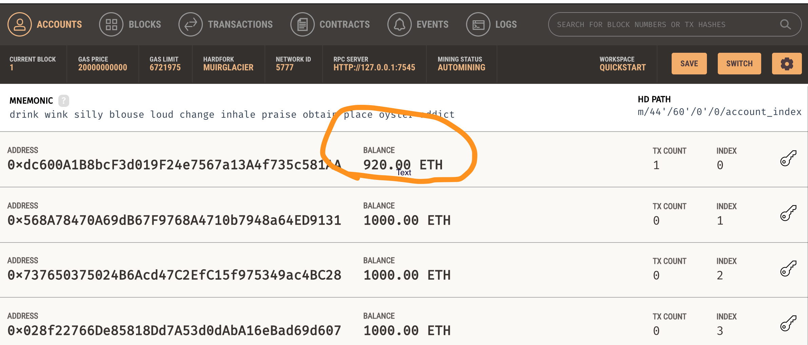

# Crypto_Wallet
## Fintech Smart Contract
 
 
I was able to update both Crypto and Krypto code to send crypto transactions 
 
 

 
 
 
 
Validating Send_Transaction buttom
 
 

 
 
 
 
 

 
 
 
 

Transaction List confirming Sender. receiver, gas and amount
 
 

